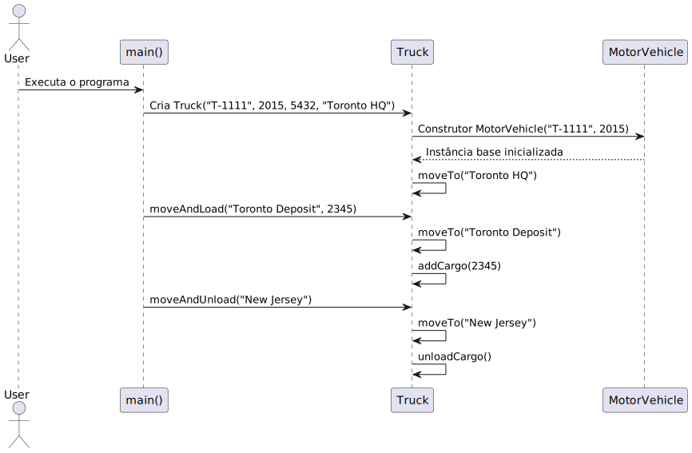

# Motor Vehicle and Truck Management System

## Table of Contents
- [Overview](#overview)
- [Features](#features)
  - [MotorVehicle Class](#motorvehicle-class)
  - [Truck Class](#truck-class)
- [Code Structure](#code-structure)
- [How to Use](#how-to-use)
- [Sample Output](#sample-output)
- [Concepts Demonstrated](#concepts-demonstrated)
- [Future Enhancements](#future-enhancements)
- [Contributions](#contributions)
- [License](#license)

---

## Overview
This project implements a **Motor Vehicle and Truck Management System** in C++ using Object-Oriented Programming principles. It simulates vehicle movement and truck cargo management with attributes such as license plates, manufacturing year, capacity, and current location.

The system is designed with OOP principles such as **inheritance**, **encapsulation**, and **polymorphism**. It showcases constructors, operator overloading, input/output handling, and interactive features.

---

## Features

### MotorVehicle Class
- Represents a general motor vehicle.
- **Attributes:**
  - License plate
  - Manufacturing year
  - Current location/address
- **Key Methods:**
  - `moveTo`: Updates the vehicle's location.
  - Overloaded `<<` and `>>` operators for formatted input and output.

### Truck Class
- Inherits from `MotorVehicle` and adds truck-specific features.
- **Additional Attributes:**
  - Cargo capacity
  - Current cargo weight
- **Key Methods:**
  - `addCargo`: Adds cargo up to the truck’s capacity.
  - `unloadCargo`: Removes all cargo.
  - Overloaded `<<` and `>>` operators for detailed input/output.

---

## Code Structure
- `MotorVehicle.h` and `MotorVehicle.cpp`: Define the `MotorVehicle` class and methods.
- `Truck.h` and `Truck.cpp`: Extend `MotorVehicle` to create the `Truck` class.
- `main.cpp`: Contains test cases to demonstrate functionality.

**Diagrams:**
### Class Diagram


### Sequence Diagram


---

## How to Use

1. **Clone the Repository:**
   ```bash
   git clone <repository_url>
   cd <repository_folder>
